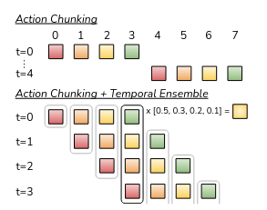
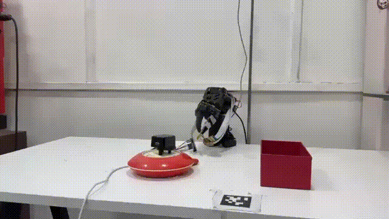
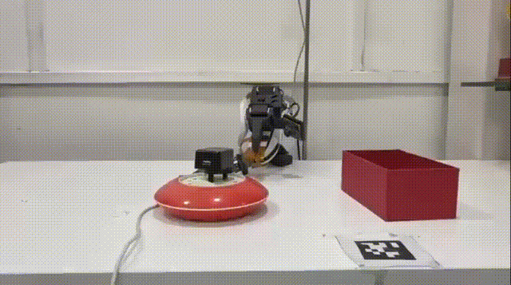
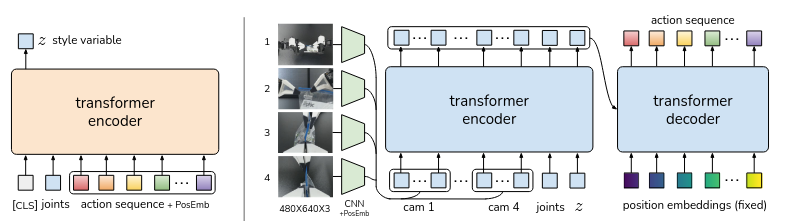

# ACT (Action Chunking with Transformers)

## Overview

ACT is one of the imitation learning approaches implemented for the SO-101 arm. Instead of predicting one action at a time, it predicts a short **chunk** of future actions in one go, then executes them before predicting the next chunk. This reduces the small errors that build up over time when a robot predicts actions one step at a time.

The Mission Mimosa setup evaluates ACT using both **vision-only** input and **vision + tactile** input. The tactile setup can incorporate sensors such as FlexiTac and eFlesh alongside the RGB camera observations.

---

## Why ACT?

* Predicting a chunk of actions at once (instead of one at a time) makes the robot's motion smoother and less jittery.
* Reduces **compounding error** — small mistakes that pile up when a policy only looks one step ahead.
* Good for tasks that need precise, human-like motion, since it's trained directly on demonstration trajectories.

---

## How It Works (Simple Explanation)

1. The policy looks at the current observation (camera image + robot state, with tactile observations when enabled).
2. Instead of predicting the next single action, it predicts a whole short sequence of future actions at once (a **chunk**).
3. The robot executes some of these actions, then looks again and predicts the next chunk.
4. Overlapping chunks are blended together so the motion stays smooth instead of jumping between chunks.



---

## Setup / Architecture

* **Input:** RGB images + robot state, with tactile observations for the tactile configuration
* **Vision Encoder:** ResNet-18
* **Action space:** Joint positions
* **Chunk size:** 16
* **Training data:** 50 episodes of pick and place (cube)
* **Training steps:** 100k

---

## Commands

The following commands are based on the current LeRobot ACT documentation.

### Training

The standard LeRobot command for training ACT is:

```bash
lerobot-train \
  --dataset.repo_id=${HF_USER}/your_dataset \
  --policy.type=act \
  --output_dir=outputs/train/act_your_dataset \
  --job_name=act_your_dataset \
  --policy.device=cuda \
  --wandb.enable=true \
  --policy.repo_id=${HF_USER}/act_policy
```

For our Mission Mimosa setup, the placeholders should be replaced with the actual dataset and policy names used for the experiment.

For example, the general structure is:

```bash
lerobot-train \
  --dataset.repo_id=<DATASET_REPO> \
  --policy.type=act \
  --output_dir=outputs/train/<OUTPUT_NAME> \
  --job_name=<JOB_NAME> \
  --policy.device=cuda \
  --wandb.enable=true \
  --policy.repo_id=<POLICY_REPO>
```

The number of training steps can also be specified using `--steps`. For example:

```bash
lerobot-train \
  --dataset.repo_id=<DATASET_REPO> \
  --policy.type=act \
  --output_dir=outputs/train/act_so101 \
  --job_name=act_so101 \
  --policy.device=cuda \
  --wandb.enable=true \
  --policy.repo_id=<POLICY_REPO> \
  --steps=100000
```

### Inference / Rollout

After training, the ACT policy can be run on the SO-101 using `lerobot-rollout`:

```bash
lerobot-rollout \
  --strategy.type=base \
  --policy.path=<POLICY_PATH> \
  --robot.type=so101_follower \
  --robot.port=/dev/ttyACM0 \
  --robot.cameras="{ front: {type: opencv, index_or_path: 0, width: 640, height: 480, fps: 30}}" \
  --display_data=true \
  --task="Your task description" \
  --duration=60
```

For ACT, the `--task` argument can be skipped according to the current LeRobot ACT documentation.

The important components of the rollout command are:

| Argument          | Purpose                                    |
| ----------------- | ------------------------------------------ |
| `--policy.path`   | Path or Hub ID of the trained ACT policy   |
| `--robot.type`    | Specifies the robot type                   |
| `--robot.port`    | Serial port used by the SO-101             |
| `--robot.cameras` | Camera configuration used during inference |
| `--display_data`  | Displays the observation/inference data    |
| `--duration`      | Duration of the rollout                    |

---

## Media

### Demo / Rollout Videos

#### ACT — Without Tactile



#### ACT — With Tactile



### Architecture Diagram



---
## Success Rate Comparison

The following table compares the success rates of ACT under **vision-only** and **vision + tactile** sensing configurations.

| Configuration    | Success Rate |
| ---------------- | -----------: |
| Vision(50eps)    |          80% |
| Vision + Tactile(50eps) |          90% |
| Vision + Tactile(20eps) |          50% |

The results show the performance difference between using visual observations alone and augmenting the policy with tactile observations.

## Known Issues / Limitations

* Motion can still be jerky during execution.
* Some task failures remain during rollout.
* Performance can vary between vision-only and tactile configurations.

---

## References

1. A. Zhao, H. Huang, D. Xu, J. Li, Y. Zhang, H. Qi, and L. Guo, **"Learning Fine-Grained Bimanual Manipulation with Low-Cost Hardware,"** *arXiv preprint arXiv:2304.13705*, 2023.
2. Hugging Face, **LeRobot — ACT Documentation**: https://huggingface.co/docs/lerobot/act

