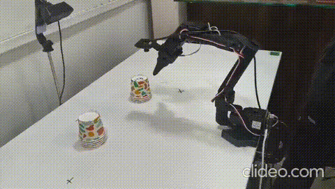
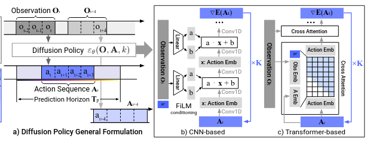

# Diffusion Policy

## Overview

Diffusion Policy is one of the imitation learning approaches implemented for the SO-101 arm. Instead of directly predicting an action, it learns to generate actions by gradually "denoising" random noise into a valid action sequence — similar to how image diffusion models generate images. This makes it good at handling multiple possible correct actions for the same situation (multimodal behavior), which is common in human demonstrations.

The policy is evaluated using **vision-based observations** from the RGB camera together with robot state information.

---

## Why Diffusion Policy?

* Handles multimodal demonstrations well (e.g. two equally valid ways to grasp an object) instead of averaging them into a bad action.
* Tends to produce smoother, more stable action trajectories compared to simple regression-based policies.
* Well suited for contact-rich tasks and can be extended with additional sensory information such as tactile observations.

---

## How It Works (Simple Explanation)

1. The policy looks at the current observation (camera image + robot state).
2. It starts with a random noisy action sequence.
3. Over several denoising steps, it refines the noise into a clean, usable action sequence conditioned on the observation.
4. The robot executes the resulting action(s).

## Conditioning on What the Camera Sees

The model only predicts the **action** — it never tries to predict what the camera will see next. It simply looks at the current image and asks "given this, what should the noisy action turn into?" Not having to also guess future images makes the model faster and easier to train.

This can be written as:

**Cleaning step** — take the current noisy action, remove a bit of predicted noise, add a small amount of fresh randomness:

$$A_t^{k-1} = \alpha \left( A_t^k - \gamma \, \varepsilon_\theta(O_t, A_t^k, k) + \mathcal{N}(0, \sigma^2 I) \right)$$

Here $A_t^k$ is the action at cleaning step $k$, $O_t$ is the current observation (image + robot state), and $\varepsilon_\theta$ is the model's guess of the noise to remove.

**Training goal** — during training, we add random noise $\varepsilon^k$ to a real action and let the model guess it back, given the observation:

$$L = \text{MSE}\left(\varepsilon^k, \, \varepsilon_\theta(O_t, A_t^0 + \varepsilon^k, k)\right)$$

The better the model's guessed noise matches the real noise, the lower the loss.

In short: *look at the image, guess the noise, remove it, repeat.*

---

## Setup / Architecture

* **Input:** RGB images + joint positions
* **Vision Encoder:** ResNet-18
* **Action space:** Joint positions
* **Prediction/Action horizon:** 32 steps
* **Number of action steps:** 24
* **Training data:** 50 episodes of cup stacking
* **Training steps:** 100k
* **Training noise scheduler:** DDPM
* **Inference noise scheduler:** DDIM

---

## Commands

### Training

The Diffusion Policy training configuration used for the experiment is:

```bash
lerobot-train \
  --dataset.repo_id=YOUR_DATASET \
  --output_dir=./outputs/diffusion_policy_training \
  --batch_size=16 \
  --steps=100000 \
  --policy.type=multi_task_dit \
  --policy.device=cuda \
  --policy.horizon=32 \
  --policy.n_action_steps=24 \
  --policy.objective=diffusion \
  --policy.noise_scheduler_type=DDPM \
  --policy.num_train_timesteps=100 \
  --policy.repo_id="HF_USER/diffusion-policy-your-robot" \
  --wandb.enable=true
```

The main training settings are:

| Argument                        |       Value | Purpose                                            |
| ------------------------------- | ----------: | -------------------------------------------------- |
| `--batch_size`                  |        `16` | Number of samples processed per training step      |
| `--steps`                       |    `100000` | Total number of training steps                     |
| `--policy.horizon`              |        `32` | Length of the predicted action horizon             |
| `--policy.n_action_steps`       |        `24` | Number of actions used from the predicted sequence |
| `--policy.objective`            | `diffusion` | Uses the diffusion objective                       |
| `--policy.noise_scheduler_type` |      `DDPM` | Noise scheduler used during training               |
| `--policy.num_train_timesteps`  |       `100` | Number of diffusion timesteps during training      |

### Inference / Rollout

For inference, the trained policy is run using the **DDIM scheduler**. DDIM allows the denoising process to use fewer inference steps than the full training diffusion process.

```bash
lerobot-rollout \
  --policy.path=<POLICY_PATH> \
  --policy.device=cuda \
  --policy.noise_scheduler_type=DDIM \
  --policy.num_inference_steps=<NUM_INFERENCE_STEPS> \
  --robot.type=so101_follower \
  --robot.port=/dev/ttyACM0 \
  --robot.cameras="{ front: {type: opencv, index_or_path: 0, width: 640, height: 480, fps: 30}}" \
  --display_data=true \
  --task="Your task description" \
  --duration=60
```

The important rollout parameters are:

| Argument                        | Purpose                                              |
| ------------------------------- | ---------------------------------------------------- |
| `--policy.path`                 | Path or Hub ID of the trained Diffusion Policy       |
| `--policy.device`               | Device used for inference                            |
| `--policy.noise_scheduler_type` | Scheduler used during inference                      |
| `--policy.num_inference_steps`  | Number of DDIM denoising steps used during inference |
| `--robot.type`                  | Specifies the SO-101 follower arm                    |
| `--robot.port`                  | Serial port used by the robot                        |
| `--robot.cameras`               | Camera configuration used during inference           |
| `--display_data`                | Displays observation/inference data                  |
| `--duration`                    | Duration of the rollout                              |

---

## Media

### Diffusion Policy Rollout

<p align="center">
  
</p>

<p align="center">
  <em>Diffusion Policy rollout on the SO-101 arm.</em>
</p>

### Diffusion Policy Pipeline

<p align="center">
  
</p>

<p align="center">
  <em>Diffusion Policy denoising pipeline.</em>
</p>

## Changes / Iteration Log

> Keep this updated as you tweak things — helps track what worked and what didn't.

| Date | Change                                                            | Reason / Result                                                                                           |
| ---- | ----------------------------------------------------------------- | --------------------------------------------------------------------------------------------------------- |
|      | Switched to a fixed camera setup instead of a shifty/handheld one | Performance improved — a stable viewpoint made it easier for the model to learn consistent visual cues    |
|      | Switched to DDIM sampler for inference                            | Noticeably better results, likely due to faster and more stable sampling compared to the standard sampler |

---

## Known Issues / Limitations

1. Slow inference due to multiple denoising steps and sensitivity to hyperparameters.
2. This policy's inference can be jerky.
3. The policy benefits from a fixed camera setup and is sensitive to changes in the observation setup.

---

## References

1. Chi, C., Feng, S., Du, Y., Xu, Z., Cousineau, E., Burchfiel, B., & Song, S. **Diffusion Policy: Visuomotor Policy Learning via Action Diffusion.** *Robotics: Science and Systems (RSS), 2023.*
2. Hugging Face. **LeRobot — Diffusion Policy Documentation.** https://huggingface.co/docs/lerobot/diffusion_policy

