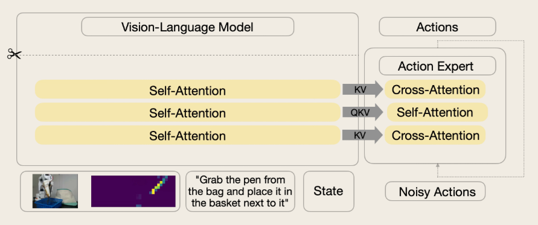

# SmolVLA (Small Vision-Language-Action Model)

## Overview

**SmolVLA** is a compact **450M-parameter Vision-Language-Action model** developed by Hugging Face for robotic manipulation.

It combines **vision, language, and robot state** to generate continuous robot actions using a **flow-matching action expert**.

For Mission Mimosa, SmolVLA is being evaluated on the **SO-101** alongside ACT, B-Spline Policy, and Diffusion Policy.

[SmolVLA Reference](https://huggingface.co/blog/smolvla)

---

## Why SmolVLA?

* Compact architecture suitable for efficient robotics experiments.
* Combines visual observations with language instructions.
* Uses flow matching for action generation.
* Provides another policy for comparison within Mission Mimosa.

---

## How It Works

```text
Camera + Robot State + Task
              │
              ▼
           SmolVLA
              │
              ▼
        Action Chunk
              │
              ▼
           SO-101
```


SmolVLA processes the current visual observation, robot state, and task instruction to generate future robot actions.

---

## Setup / Architecture

* **Model:** SmolVLA-450M
* **Input:** Camera images + robot state + task instruction
* **Action Expert:** Flow-matching transformer
* **Robot:** SO-101
* **Framework:** LeRobot

---

## Dataset Collection

### Vision Only

The vision-only dataset contains camera observations and robot state without tactile input.

```bash
lerobot-record \
  --robot.type=so101_follower \
  --robot.port=/dev/ttyACM0 \
  --robot.id=<ROBOT_ID> \
  --robot.cameras="{ front: {type: opencv, index_or_path: 0, width: 640, height: 480, fps: 30}}" \
  --dataset.repo_id=<DATASET_REPO> \
  --dataset.single_task="Your task"
```

### Vision + Tactile

The tactile-enabled dataset combines visual observations, robot state, and tactile observations through the **LeFlexiTac** integration.

---

## Training

### Vision Only

The vision-only SmolVLA model is trained using the `svla_so100_stacking` dataset:

```bash
python lerobot/scripts/train.py \
  --policy.type=smolvla \
  --dataset.repo_id=lerobot/svla_so100_stacking \
  --batch_size=64 \
  --steps=200000
```

### Vision + Tactile

The tactile model is trained using the SmolVLA base model with tactile observations enabled:

```bash
lerobot-train \
  --policy.path=lerobot/smolvla_base \
  --dataset.repo_id=${HF_USER}/tactile_pen_bag \
  --rename_map='{"observation.images.top": "observation.images.camera1"}' \
  --policy.empty_cameras=2 \
  --policy.use_tactile=true \
  --policy.tactile_features='["observation.tactile.primary"]' \
  --policy.n_tactile_tokens=4 \
  --policy.tactile_feature_dim=256 \
  --policy.frame_stride=3 \
  --policy.repo_id=${HF_USER}/smolvla_tactile_pen_bag \
  --output_dir=outputs/train/smolvla_tactile_pen_bag \
  --batch_size=64 \
  --steps=40000 \
  --policy.device=cuda \
  --wandb.enable=true
```

---

## Inference

### Vision-Only Rollout

```bash
lerobot-rollout \
  --strategy.type=base \
  --policy.path=<VISION_POLICY_PATH> \
  --robot.type=so101_follower \
  --robot.port=/dev/ttyACM0 \
  --robot.cameras="{ front: {type: opencv, index_or_path: 0, width: 640, height: 480, fps: 30}}" \
  --display_data=true \
  --duration=60
```

**Rollout:**


### Vision + Tactile Rollout

The tactile-enabled policy uses visual observations together with tactile observations provided through **LeFlexiTac**.


**Rollout:**


---

## Experimental Comparison

| Setup            | Vision | Tactile | Success Rate |
| :--------------- | :----: | :-----: | :----------: |
| Vision Only      |    ✓   |    —    |       —      |
| Vision + Tactile |    ✓   |    ✓    |       —      |

---

## Known Issues

* The **world model did not run properly** during the current experiments.

---

## Future Work

* Fix the world-model pipeline.
* Complete reliable SmolVLA rollouts.

---

## Reference

[Hugging Face — SmolVLA](https://huggingface.co/blog/smolvla)
