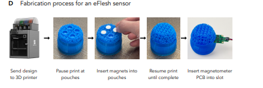
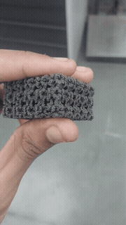
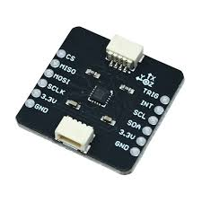

# eFlesh Tactile Sensor

**Mission Mimosa | Tactile Sensing**

## Overview

[eFlesh](https://arxiv.org/abs/2506.09994) is a customizable magnetic tactile sensing platform based on **3D-printed cut-cell microstructures**. The sensor uses embedded magnets whose positions change when the soft structure deforms under contact. These magnetic-field changes are measured using magnetometers to estimate contact information.

As part of **Mission Mimosa**, we are integrating eFlesh into our visuo-tactile manipulation system for the **SO101 robotic arms**. The goal is to provide robots with contact information that complements visual observations during manipulation.

The original eFlesh framework provides tools for generating application-specific sensor geometries from CAD models and fabricating them using 3D printing.




---

## Sensor Principle

eFlesh uses a soft, 3D-printed structure containing **magnet pockets**. When the sensor is deformed by contact, the embedded magnets move relative to the magnetometer.

```text
             Applied Contact
                    ↓
          ┌─────────────────┐
          │  Soft TPU Skin  │
          │   ●   ●   ●     │
          │      Magnets     │
          └────────┬────────┘
                   ↓
            Magnetic Field
                   ↓
             Magnetometer
                   ↓
          Contact Localization
```

The deformation of the microstructure changes the magnetic field measured by the magnetometer, allowing the system to infer the location and nature of contact.

The eFlesh design is based on **tiled, parameterized microstructures**, allowing the geometry and mechanical response of the sensor to be customized for different applications.

---

## Microstructure & Fabrication

The eFlesh framework converts a desired **OBJ/STL geometry** into a printable sensor structure using its microstructure generation pipeline.

The resulting structure is fabricated using **TPU 95A** through 3D printing. Magnet pockets are incorporated directly into the generated geometry, allowing magnets to be embedded inside the printed skin.

```text
CAD / STL Model
       ↓
eFlesh Microstructure Generation
       ↓
Generated STL
       ↓
TPU 3D Printing
       ↓
Embed Magnets
       ↓
eFlesh Sensor
```

The original eFlesh repository provides the microstructure generation and fabrication workflow.

---

## Mechanical Properties

One of the key advantages of eFlesh is that its **mechanical response can be customized through the microstructure geometry and material parameters**.

The Young's modulus used by the eFlesh generation pipeline is currently **hardcoded in the implementation**. This value can be modified to change the assumed material stiffness when generating the sensor.




```text
Young's Modulus
       ↓
Microstructure Mechanics
       ↓
Sensor Deformation
       ↓
Magnet Displacement
       ↓
Magnetic Field Change
```

Therefore, changing the Young's modulus provides a way to experiment with different stiffness assumptions and sensor responses.

For our implementation, determining the appropriate **softness/stiffness of the printed TPU sensor** is an important part of the sensor design process.

---

## Magnetometer-Based Sensing

The deformation of the eFlesh skin is measured through changes in the magnetic field generated by the embedded magnets.

For our initial implementation, we plan to use the **MLX90393 magnetometer module** for contact localization.





```text
eFlesh Skin
    ↓
Embedded Magnets
    ↓
Magnetic Field Changes
    ↓
MLX90393 Magnetometer
    ↓
Magnetic Measurements
    ↓
Contact Localization
```

The eFlesh reference implementation uses magnetometer electronics for sensing the magnetic-field changes produced by deformation.

---

## Contact Localization

The primary sensing objective is to determine **where contact occurs on the eFlesh surface**.

```text
             Contact
                ↓
        Skin Deformation
                ↓
        Magnet Movement
                ↓
       Magnetic Field Change
                ↓
        MLX90393 Readings
                ↓
       Contact Localization
```

The original eFlesh work demonstrates high-resolution contact localization and force estimation using magnetic measurements.

---

## SO101 Integration

The eFlesh sensor is intended to be integrated with our **SO101 robotic arms** as a tactile sensing modality alongside vision.

The overall observation pipeline is:

```text
              ┌──────────┐
              │  Camera  │
              └────┬─────┘
                   │
                   ↓
              Visual Data
                   │
                   │
eFlesh ──→ Tactile Data
                   │
                   ↓
          Visual + Tactile
             Observation
                   ↓
            Learning Policy
                   ↓
                 SO101
```

This allows the robot to combine visual information with tactile contact information during manipulation.

---

## Visuo-Tactile Learning

The long-term objective is to investigate whether adding eFlesh tactile observations improves robotic manipulation compared with vision-only policies.

The planned comparison is:

```text
                    ┌──→ ACT
Vision Only ────────┤
                    └──→ Diffusion Policy


                    ┌──→ ACT
Vision + Tactile ──┤
                    └──→ Diffusion Policy
```

The tactile information can provide additional information about **contact, deformation, and interaction forces** that may be difficult to infer from vision alone.

The original eFlesh work also demonstrates its use in slip detection and visuo-tactile manipulation.


---

## References

* [eFlesh Paper — arXiv:2506.09994](https://arxiv.org/abs/2506.09994)
* [eFlesh GitHub Repository](https://github.com/notvenky/eFlesh)
* [eFlesh Project Website](https://e-flesh.com/)
* [AnySkin](https://any-skin.github.io/)
* [ReSkin](https://reskin.dev/)
* [Visuo-Skin](https://visuoskin.github.io/)


