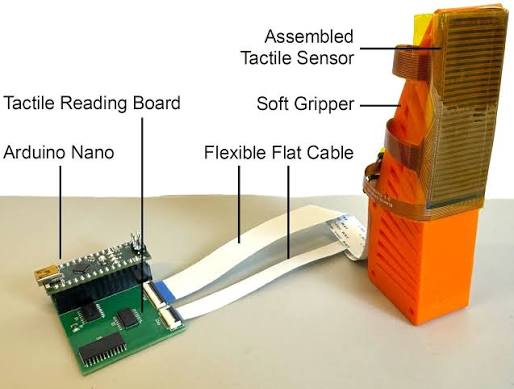
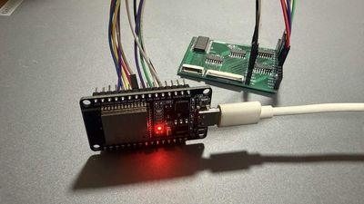

# FlexiTac Tactile Sensor

**Mission Mimosa | Tactile Sensing**

## Overview

[FlexiTac](https://flexitac.github.io/) is a flexible tactile sensing platform designed for robotic manipulation. It provides spatial contact information that complements visual observations, enabling robots to perceive physical interactions that may not be visible to a camera.

As part of **Mission Mimosa**, we are integrating FlexiTac with our **SO101 robotic arms** to build a visuo-tactile manipulation system. The objective is to combine visual and tactile observations and investigate their impact on robot manipulation policies.

The original FlexiTac system uses an **Arduino Nano** for sensor readout. Our implementation adapts the readout system to an **ESP32 DevKit** using **ESP-IDF**.

---

## Sensor Architecture

FlexiTac uses a **piezoresistive sensing layer** placed between flexible electrode layers. When pressure is applied to the sensor, the electrical resistance of the sensing material changes. The readout electronics scan the sensing matrix and convert these changes into spatial tactile measurements.

Our sensor consists of a **16 × 32 sensing array**, providing:

* **16 rows**
* **32 columns**
* **512 sensing elements (taxels)**

```text
             Applied Pressure
                    ↓
             ┌─────────────┐
             │     FPC     │
             ├─────────────┤
             │Piezoresistive│
             │    Layer    │
             ├─────────────┤
             │     FPC     │
             └──────┬──────┘
                    ↓
              Readout Board
                    ↓
                  ESP32
```



*FlexiTac tactile sensor used in the Mission Mimosa system.*

For details about the sensing technology, see the [FlexiTac paper](https://arxiv.org/abs/2604.28156).

---

## Readout Electronics

The FlexiTac sensor is connected to a dedicated **16 × 32 readout board**, which provides the circuitry required to scan the sensing matrix.

The readout system can be represented as:

```text
FlexiTac Sensor
       ↓
Readout Board
       ↓
ESP32 DevKit
       ↓
Host Computer
```

The ESP32 controls the row/column scanning and acquires the sensor measurements through its ADC interface.



*FlexiTac 16 × 32 readout board.*

---

## ESP32 Integration

The original FlexiTac implementation is based on an Arduino Nano. For Mission Mimosa, the readout firmware is adapted to an **ESP32 DevKit** using **ESP-IDF**.

### Pin Mapping

| Function             | ESP32 GPIO |
| -------------------- | ---------: |
| ADC Input            |    GPIO 36 |
| Shift Register Data  |    GPIO 14 |
| Shift Register Clock |    GPIO 27 |
| MUX S0               |    GPIO 32 |
| MUX S1               |    GPIO 33 |
| MUX S2               |    GPIO 12 |

The ESP32 performs the sensor scanning and transmits the acquired tactile measurements to the host computer through serial communication.

---

## Tactile Data Pipeline

The complete tactile data pipeline is:

```text
┌──────────────────┐
│ FlexiTac Sensor  │
└────────┬─────────┘
         ↓
┌──────────────────┐
│  Readout Board   │
└────────┬─────────┘
         ↓
┌──────────────────┐
│   ESP32 + ESP-IDF│
└────────┬─────────┘
         ↓
      Serial
         ↓
┌──────────────────┐
│ Python Interface │
└────────┬─────────┘
         ↓
┌──────────────────┐
│ Tactile Heatmap  │
└──────────────────┘
```

A Python-based visualization interface is used to convert the sensor readings into a spatial **16 × 32 tactile heatmap**.


*Example tactile visualization of the FlexiTac sensing array.*

---

## SO101 Integration

The tactile sensing system is designed to be integrated with **SO101 robotic arms** as an additional sensing modality alongside vision.

The resulting observation pipeline is:

```text
             ┌──────────┐
             │  Camera  │
             └────┬─────┘
                  │
                  ├──────────┐
                  ↓          ↓
             Visual Data   Tactile Data
                  │          │
                  └────┬─────┘
                       ↓
              Visual + Tactile
                 Observation
                       ↓
                Learning Policy
                       ↓
                    SO101
```

This allows the robot to use both **visual information** and **contact information** during manipulation.

For additional reference, see the [LeFlexiTac documentation](https://tna001-ai.github.io/LeFlexiTac/docs.html).

---

## PyFlexiTac

[PyFlexiTac](https://github.com/FlexiTac/FlexiTac_Hardware_Repo) provides software utilities for interacting with FlexiTac hardware, including tactile streaming and visualization.

The Python package can be installed using:

```bash
pip install "flexitac[examples]"
```

The FlexiTac ecosystem also supports high-speed tactile streaming. Our ESP32 implementation follows the same general concept while adapting the communication and readout system for the ESP32 platform.

---

## Visuo-Tactile Learning

The long-term objective of integrating FlexiTac with the SO101 is to study whether tactile observations improve robotic manipulation compared with vision-only approaches.

We plan to compare:

```text
                    ┌──→ ACT
Vision Only ────────┤
                    └──→ Diffusion Policy


                    ┌──→ ACT
Vision + Tactile ──┤
                    └──→ Diffusion Policy
```

This provides a direct comparison between:

* **Vision-only policies**
* **Vision + tactile policies**
* **ACT**
* **Diffusion Policy**

The tactile sensor is intended to provide additional information about **contact location, interaction, and physical state** that may be difficult to infer from vision alone.

---

## References

* [FlexiTac Project](https://flexitac.github.io/)
* [FlexiTac Paper "arXiv:2604.28156"](https://arxiv.org/abs/2604.28156)
* [FlexiTac Hardware Repository](https://github.com/FlexiTac/FlexiTac_Hardware_Repo)
* [LeFlexiTac Documentation](https://tna001-ai.github.io/LeFlexiTac/docs.html)